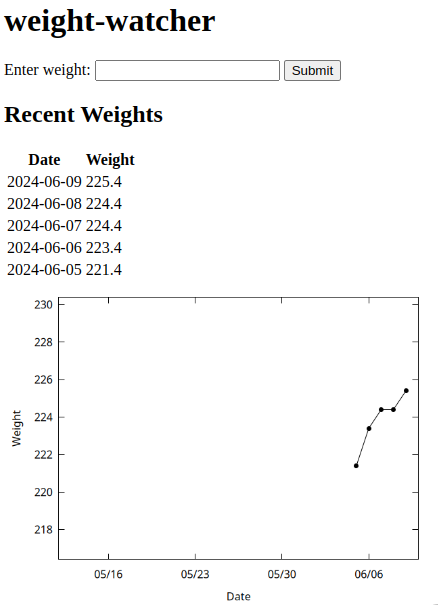

# weight-watcher
Simple web app to record body weights over time



## Installation

``` shell
cargo install --path .
```

### Dependencies
The only dependency not handled by cargo is the [gnuplot][gnuplot] plotting
package used to produce the graph on the main screen.

## Usage
Run in the background to connect from another device:

``` shell
weight-watcher & disown
```

`disown` alone works for zsh, but you may need `disown -h` for bash, for
example.

Then navigate to `localhost:9999` on the machine running `weight-watcher` or
`192.168.x.x:9999` from another device, where 192.168.x.x is the IP address for
the machine running `weight-watcher`.

[gnuplot]: http://www.gnuplot.info/
